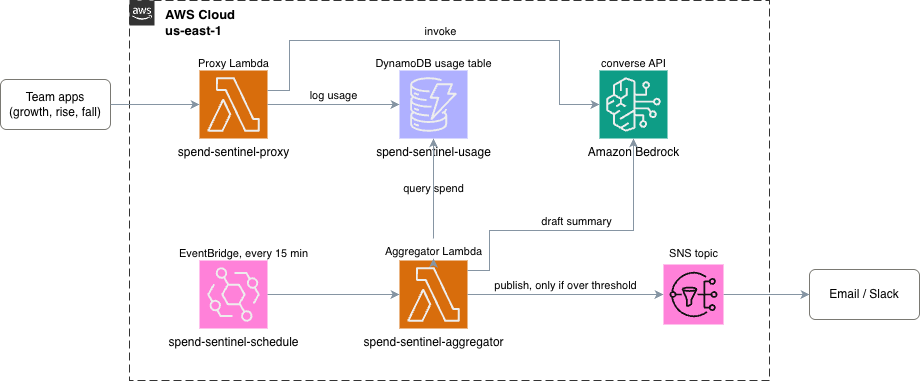
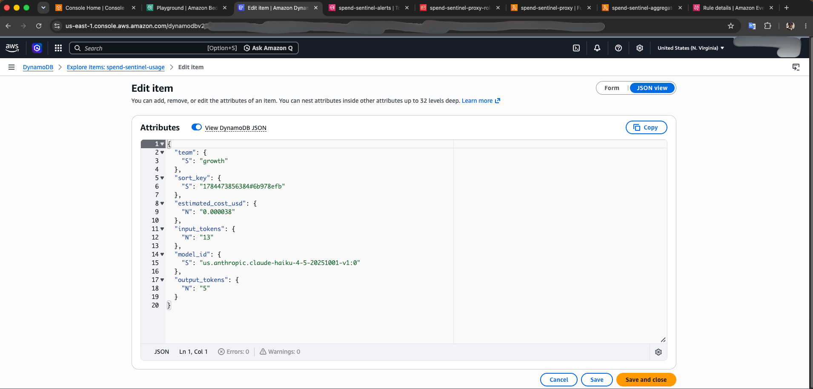
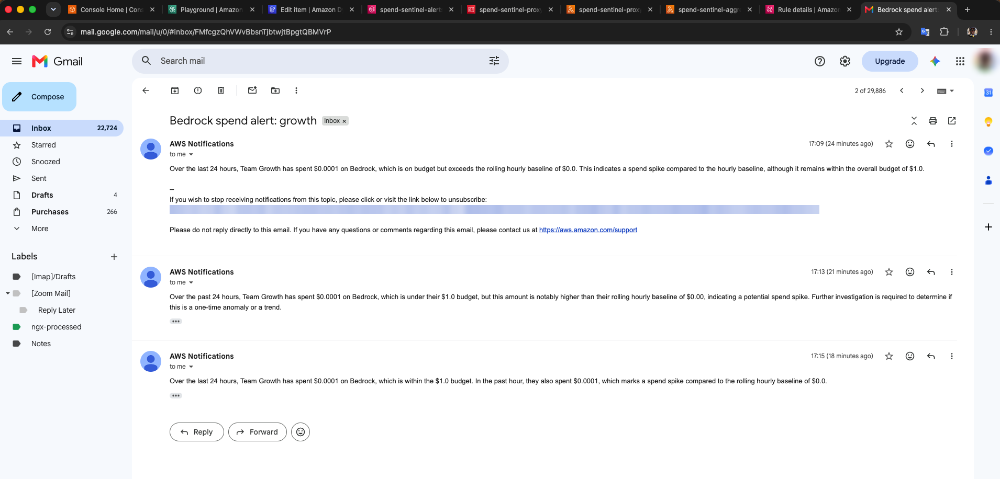

# Bedrock Spend Sentinel

A serverless system that self-meters Amazon Bedrock spend per team, checks it against a budget, and uses Bedrock itself to draft a plain-English alert when a team is over budget or spending faster than usual.

Built and tested end-to-end in `us-east-1`.

---

## The problem

Once a Bedrock account is shared across teams, the bill shows up as one line item. AWS's own cost tools do not close that gap quickly: Cost Explorer and the Cost and Usage Report refresh roughly once a day, which is too slow for fast-moving GenAI experimentation budgets. Spend Sentinel meters usage at the point of call instead, so a team's spend is visible within minutes — not the next day.

---

## Architecture



1. Team apps call Bedrock only through the **proxy Lambda**, never directly.
2. The proxy calls Bedrock's `converse` API, then logs the team, model, token counts, and a self-calculated cost to DynamoDB.
3. A scheduled **aggregator Lambda** runs every 15 minutes, checks each team's spend against its budget and against its own rolling hourly baseline.
4. When a team is over budget or spending faster than its baseline, the aggregator calls Bedrock once more to draft a short, plain-English alert.
5. That alert goes out over SNS to email (Slack works the same way through a webhook subscription).

---

## Repository structure

```
bedrock-spend-sentinel/
├── src/
│   ├── proxy/
│   │   └── lambda_function.py      # Bedrock proxy - logs usage to DynamoDB
│   └── aggregator/
│       └── lambda_function.py      # Budget checker - fires SNS alerts
├── infrastructure/
│   ├── template.yaml               # CloudFormation stack (all resources)
│   └── deploy.sh                   # One-command packaging + deploy script
├── docs/
│   └── SETUP.md                    # Full setup and troubleshooting guide
└── images/
    ├── sentinel-architecture.png
    ├── architecture.drawio
    ├── dynamodb-usage-item.png
    └── sns-spend-alert-email-blurred.png
```

---

## AWS resources deployed

| Resource | Name |
|---|---|
| DynamoDB table | `spend-sentinel-usage` |
| Proxy Lambda | `spend-sentinel-proxy` |
| Aggregator Lambda | `spend-sentinel-aggregator` |
| Proxy IAM role | `spend-sentinel-proxy-role` |
| Aggregator IAM role | `spend-sentinel-aggregator-role` |
| SNS topic | `spend-sentinel-alerts` |
| EventBridge rule | `spend-sentinel-schedule` (`rate(15 minutes)`) |
| Summary model | `us.anthropic.claude-haiku-4-5-20251001-v1:0` |

---

## Quick start

```bash
git clone https://github.com/<your-org>/bedrock-spend-sentinel.git
cd bedrock-spend-sentinel
./infrastructure/deploy.sh bedrock-spend-sentinel ops@example.com us-east-1
```

See [docs/SETUP.md](./docs/SETUP.md) for full prerequisites, manual deploy steps, configuration reference, and troubleshooting.

---

## Test run

Three teams were used to exercise the budget and anomaly logic: `growth`, `rise`, and `fall`.

**Usage logging.** A live item from `spend-sentinel-usage` for team `growth`: 13 input tokens, 5 output tokens, model `us.anthropic.claude-haiku-4-5-20251001-v1:0`, estimated cost `$0.000038`. That is real per-call cost visibility down to fractions of a cent — well ahead of anything Cost Explorer would show for the same call.



**Alerting.** Three consecutive SNS emails fired for team `growth` as its hourly spend crossed the rolling baseline. Each was a Bedrock-drafted summary stating the team was within its overall budget but spending above its hourly baseline — flagged as a spend spike worth investigating.



---

## Configuration

All configuration is via Lambda environment variables. Key settings on the aggregator:

| Variable | Default | Description |
|---|---|---|
| `BUDGETS_USD_24H` | `{"default": 5.0}` | JSON map of team name to 24h USD budget |
| `ANOMALY_MULTIPLIER` | `1.5` | Last-hour spend multiple above baseline that triggers a spike alert |
| `SUMMARY_MODEL_ID` | `us.anthropic.claude-haiku-4-5-20251001-v1:0` | Bedrock model used to draft alert text |

See [docs/SETUP.md#configuration](./docs/SETUP.md#configuration) for the full variable reference.

---

## Known limitations

- Budgets are set via a Lambda environment variable (`BUDGETS_USD_24H`). Changing a budget requires updating the environment variable (no redeploy needed, but it is not self-service for teams).
- Per-token pricing is hardcoded in `src/proxy/lambda_function.py` and must be kept in sync with the [Bedrock pricing page](https://aws.amazon.com/bedrock/pricing/).
- The anomaly check is a simple rolling baseline multiplier, not a seasonality-aware model.

## Possible next steps

- Move budgets into a `spend-sentinel-budgets` DynamoDB table so they can change without touching environment variables.
- Add a Lambda function URL in front of the proxy for a live browser demo.
- Feed the usage table into a lightweight dashboard (S3 + Athena, or QuickSight).
- Add per-model cost breakdown to the alert summary.
- Support Slack webhook subscriptions on the SNS topic.

---

## Contributing

Pull requests are welcome. See [CONTRIBUTING.md](./CONTRIBUTING.md) for guidelines.

## License

MIT — see [LICENSE](./LICENSE).
